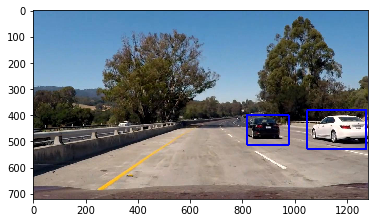
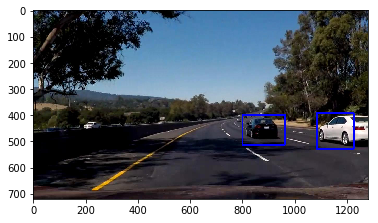

**Vehicle Detection Project**

The goals / steps of this project are the following:

* Perform a Histogram of Oriented Gradients (HOG) feature extraction on a labeled training set of images and train a classifier Linear SVM classifier
* Optionally, you can also apply a color transform and append binned color features, as well as histograms of color, to your HOG feature vector. 
* Note: for those first two steps don't forget to normalize your features and randomize a selection for training and testing.
* Implement a sliding-window technique and use your trained classifier to search for vehicles in images.
* Run your pipeline on a video stream (start with the test_video.mp4 and later implement on full project_video.mp4) and create a heat map of recurring detections frame by frame to reject outliers and follow detected vehicles.
* Estimate a bounding box for vehicles detected.

[//]: # (Image References)
[image1]: ./examples/car_not_car.png
[image2]: ./examples/HOG_example.png
[image3]: ./examples/sliding_windows.jpg
[image4]: ./examples/sliding_window.jpg
[image5]: ./examples/bboxes_and_heat.png
[image6]: ./examples/labels_map.png
[image7]: ./examples/output_bboxes.png
[video1]: ./project_video.mp4

---
### Writeup

#### following Writeup includes all the rubric points and how they are addressed 

### Histogram of Oriented Gradients (HOG)

#### 1. Explain how (and identify where in your code) you extracted HOG features from the training images.

The code for this step is contained in the first code cell of the IPython notebook function name is: ** _get_hog_features_ **. This is pretty same like from class quiz  

The given training images are read into `vehicle` and `non-vehicle` seperately.  Here is an example of one of each of the `vehicle` and `non-vehicle` classes:

![car][image1]

I then explored different color spaces and different `skimage.hog()` parameters (`orientations`, `pixels_per_cell`, and `cells_per_block`).  I grabbed random images from each of the two classes and displayed them to get a feel for what the `skimage.hog()` output looks like.

Here is an example using the `YCrCb` color space and HOG parameters of `orientations=8`, `pixels_per_cell=(8, 8)` and `cells_per_block=(2, 2)`:

![alt text][image2]

#### 2. Explain how the final choice of HOG parameters comes.

I tried various combinations of parameters and different color space. 

#### 3. how a classifier is trained using selected features.

Following features are used for classifier feature extraction:
* the HOG feature with the parameter: orient = 9, pix_per_cell = 8, cell_per_block = 2.
* "ALL" three channel hog features are concatinated
* color histogram is used with 32 bins
* spatial feature is used with 32 bin for color distribution.

Each image extracts above feature to form a single feature vector.

For the car and non-car image, extract feature vector for each image.
then use the standardScaler to normalize the feature before do the classifier training.
The data is plit into 80% trainig and 20% validation. 

The classifier uses linear classifier.

The accuracy is 0.9882

### Sliding Window Search

#### 1. This is most tricky part and it took lots of time experiment to video to make sure every frame is detected car if it exists. The function is in **_find_car_in_image_**

* this function mainly define where to search the window for cars. 
* mostly focus on the right side of car for the computation purpose since the video has no
* car on left. it certainly can covers from x_start_stop =[None, None]
* the strategy used here is for the view far from driver, use small xy_window size, such as:
* (64, 64), (90, 90) and smaller overlap such as 0.7 or 0.8
* for the view are close to driver car, use large window size such as (90, 90), (130,130) and (150, 150)
* the overlap uses bigger overlap so that car can be detect mutiple times. The heat threshold > 1 will not mask off the big car.
* more area is in between x_start_stop[700, 1050] for car is small.
* x_start_stop[1000, None] for closer car appears bigger on with larger overlap such as 0.8 and 0.9

The image is read in as RGB and scaled between [0, 1] as the classifier used png image.

![alt text][image3]

#### 2. Show some examples of test images to demonstrate how your pipeline is working.  What did you do to optimize the performance of your classifier?

The pipeline works in following flow for each every frame:
* **_find_windws_** which returns each sub block is indentified a car. It calls various windows scale to search different place. the searching window scale ideally uses four different scale such as small(64, 64), two medium scales (90, 90) and (130, 130) and finally the largest scale (150, 150). It searches mainly on lower right portion of image.
* each search windows is resized to (64, 64) and uses exact method to obtain the feature vector.
* the feature feature is fed into previously trained classifier to see if it is car or not-car.
* **_search_windows_** returns all sub windows that is indentified car.
* apply the heat map and heat threshold 
* draw the final bounding box on original image.

Initially used RGB color space and only one channel for HOG feature. The classifier accuracy is around 0.9 something. Later found out adding more channel for HOG increase the accuracy. After that, I add all the features which came from class, such as color histgram and spatial bins. The YCrCb later is found to be better detecting the white car. 

The search area is purposely placed in the lower and right corner, x starting from 700 and y start from 380.
in this area, different search window area is focused.

Ultimately I searched on few different scales using YCrCb 3-channel HOG features plus spatially binned color and histograms of color in the feature vector, which provided a nice result.  Here are some example images:

 

---

### Video Implementation

#### 1. Here's a [link to my video result](./project_video.mp4)

#### 2. Describe how (and identify where in your code) you implemented some kind of filter for false positives and some method for combining overlapping bounding boxes.

I recorded the positions of positive detections in each frame of the video.  From the positive detections I created a heatmap and then thresholded that map to identify vehicle positions.  I then used `scipy.ndimage.measurements.label()` to identify individual blobs in the heatmap.  I then assumed each blob corresponded to a vehicle.  I constructed bounding boxes to cover the area of each blob detected.  

Here's an example result showing the heatmap from a series of frames of video, the result of `scipy.ndimage.measurements.label()` and the bounding boxes then overlaid on the last frame of video:

### Here are six frames and their corresponding heatmaps:

![alt text][image5]

### Here is the output of `scipy.ndimage.measurements.label()` on the integrated heatmap from all six frames:
![alt text][image6]

### Here the resulting bounding boxes are drawn onto the last frame in the series:
![alt text][image7]

---

### Discussion

#### 1. problems / issues faced in your implementation of this project. 
* 1. about the white car is missed like invisible one. can not detect it. This has been debug with fare amount of time. Initially did not pay attention to color space is read in and fed into the classifier. the image in training is png while the frame is jpg. the read in method `matplotlib.imagge.imread` read in as [0, 255] while read in png as range [0, 1]. even thoug the classifier still return classification it actually does not mean things right. Later after print out the image content and quickly figure out the pixel value needs to scale to [0, 255]

* 2. Did not use all the feature to form the feature vector. the classification accuracy is not high enough
after used almost all features known from class, it is reaching to 0.98

* 3. then most of time is to figure out some picture does not have right bounding box, such as two bounding box or no bounding box. for some picture, if heatmap threshold set to 0, it actually works. but when process the each frame in continous mode, expect same heatmap threshold works for every frame. when set to 1, some image does not find car while threshold set to 1 work. In order to do, I purposerly add few minor search window area to search again in order to make the threshold to 2.

* 4. the overlap is one of major parameter to tune. initially did not pay attention. I spent some time to see how to detect some frame car. It seems like we need more window search. One way to do it is to add slide window search. Another way is to increase the overlap percentage. The inital 0.5 is good for small area such as (64, 64) size. for big car size, 0.5 overlap easily miss the catch. so for the right hand side big search window, uses 0.8 or 0.9 search overlap.
* 5. adding search window dramatically increase the computation. initially if have only two scales, the entire video only take 20 minutes. When adding more search window scale, it takes 3 or 4 hours to complete vedio. I have split up the entire video into six sub clip and forked off 6 process on AWS to run in parallel. at the end then combine six video into one.

My pipeline could fail or maybe fail:
1. if there is car cut in which shows big but my big search windows size is smaller than it. so no car is detected.

What could be improved? lots of them.
1. seems better slide window algorithm could be applied to dynamically adjust the search strips or sub area. for example if we know there is island or yellow line on left side of car, so no need to detect cars on left. 
2. if a new car identified, its speed and direction could be projected using calculation and which in turn can help define the search area.
3. in real usage, all the different search can be run in parallel or maybe accelarated in parallel
4. each lane could draw 3D pipe in which each car is supposed to drive through it. this could help detect the search area far and near.

